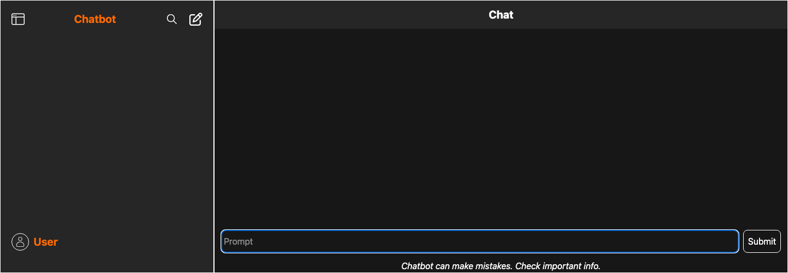
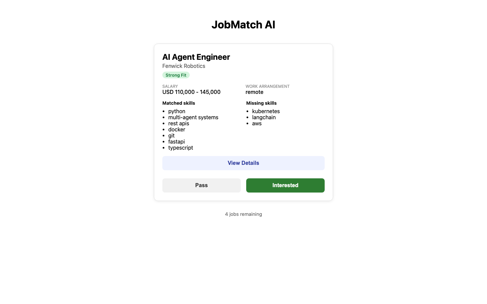
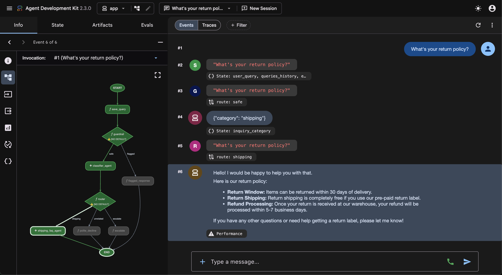
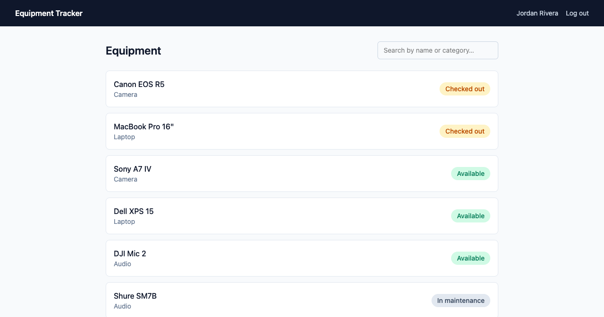

# 👋 Hi, I'm **Ali Kirat**

## 💻 Full-Stack Software Engineer | React · TypeScript · Node.js · Python · AI/LLM Integration

Full-stack software engineer with **2+ years of experience** building and deploying production web applications using React, TypeScript, Node.js, Python, and MongoDB. I integrate LLM APIs and AI agent systems as a core part of how I build, not as an afterthought.

I bring strong communication and cross-functional collaboration skills from a background in education and business consulting, and I use Claude Code and GitHub Copilot as daily development tools.

📍 Claremont, CA  
📧 alikirat.dev@gmail.com  

---

## ⭐ Featured Projects

### 🚕 Atlas Taxi: Full-Stack Ride Booking Platform

A production MERN stack application with TypeScript, JWT authentication, role-based dashboards, and CI/CD deployment.

**Tech Stack:**  

🔗 **Live Demo:** https://atlastaxi.netlify.app  
🔗 **Frontend Repo:** https://github.com/alikirat/atlas-taxi-frontend  
🔗 **Backend Repo:** https://github.com/alikirat/atlas-taxi-backend

**Highlights**
- 🔐 JWT authentication with bcrypt, secure httpOnly cookies, and role-based access control
- 📅 Ride scheduling, cancellation, and admin management dashboard
- 🔁 12+ protected REST API endpoints with validation and error handling
- 🗄 MongoDB data modeling with indexing
- 🧪 Vitest + Supertest test suite against an in-memory MongoDB
- ☁️ CI/CD deployment via GitHub Actions to Netlify and Render
- 📜 Licensed PolyForm Shield: source-available, not open source

---

### 🤖 Chatbot: AI Chat App with Per-User Accounts

A chat app built with the Groq API, with JWT-based user accounts so each person's conversation history is private to their own account.

**Tech Stack:**  

🔗 **Live Demo:** https://akdev-chatbot.netlify.app  
🔗 **Frontend Repo:** https://github.com/alikirat/chatbot  
🔗 **Backend Repo:** https://github.com/alikirat/chatbot-backend

**Highlights**
- 🔐 JWT-based user accounts (register/login), bcrypt-hashed passwords
- 🔒 Chats scoped per user, with ownership checks on every read/write
- 💬 Groq-powered chat responses with persistent conversation history
- 🧪 Vitest + Supertest test suite against an in-memory MongoDB
- 🔑 One-click demo login for trying it out without signing up

---

### 🎯 JobMatch AI: AI-Powered Job Search Assistant

An AI-powered job search assistant that ingests job postings, scores them against your resume, analyzes skill gaps, and helps optimize your resume content, surfaced through a swipeable review interface.

**Tech Stack:**  

🔗 **Repo:** https://github.com/alikirat/jobmatch-ai

**Highlights**
- 🔁 Multi-stage agent graph: ingest → ATS gate check → semantic fit scoring → gap analysis → resume optimization
- ⚙️ FastAPI backend with MongoDB persistence
- 📱 React + TypeScript swipeable review interface
- 🤖 Google ADK 2.0 workflow powered by Gemini
- 🔌 Adzuna API integration for live job ingestion
- 📜 Licensed PolyForm Noncommercial: source-available, not open source

---

### 🎧 Customer Support Graph Agent: Multi-Agent Support Routing

A graph-based AI customer support representative built with Google ADK 2.0. Classifies incoming customer queries and routes them to a shipping FAQ agent or a polite decline node for out-of-scope requests.

**Tech Stack:**  

🔗 **Repo:** https://github.com/alikirat/customer-support-agent

**Highlights**
- 🧭 Graph workflow with Pydantic-based query classification
- 📦 Shipping FAQ agent with playful, emoji-rich responses
- 🚫 Polite decline routing for out-of-scope queries
- 🧪 Unit-tested with ruff/ty validation
- 🐳 Dockerized for deployment

---

### 📦 Equipment Tracker: Internal Asset Checkout System

An internal tool for tracking physical equipment and asset checkouts. Staff check items in and out with live status updates, admins manage the catalog and checkout history through a separate panel.

**Tech Stack:**  

🔗 **Repo:** https://github.com/alikirat/equipment-tracker

**Highlights**
- 🔁 Livewire check-out/check-in flow, no page reloads
- 🔍 Alpine-powered live search on the equipment list
- 📧 Queued overdue-return email notification, dispatched as a real job
- 📝 Event/listener pair logging every checkout
- 🗂️ FilamentPHP admin panel with read-only checkout history to protect the audit trail
- 📜 Licensed PolyForm Shield: source-available, not open source

---

## 🛠️ Tech Stack

### Languages

### Frontend

### Backend & Database

### AI & LLM

### Cloud & DevOps

### Tools

---

## 🏆 Certifications

- 🤖 **AI Agents Intensive**: Kaggle x Google | Dec 2025 | Multi-agent systems, LLM orchestration, tool use, and evaluation using Gemini and Google ADK
- 💻 **Frontend Development**: Skillcrush | Dec 2022
- ⚙️ **Software Engineering**: Per Scholas | Apr 2025 | Full-Stack JavaScript, TypeScript, React, Node.js

---

## 📊 GitHub Stats

---

## 🤝 Let's Connect

I'm actively seeking **full-stack** and **AI-focused** software engineering roles.

